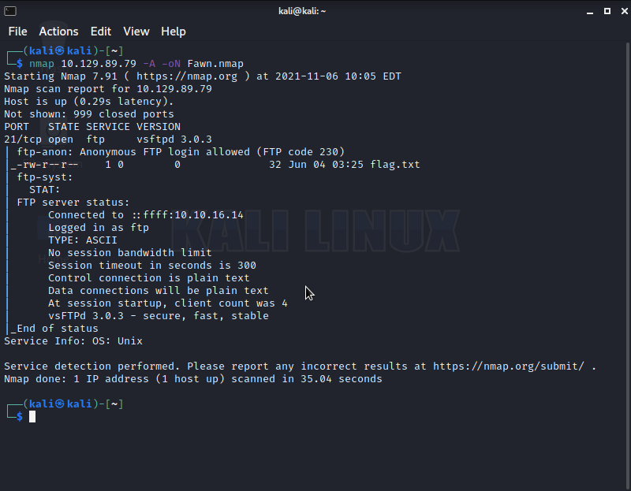
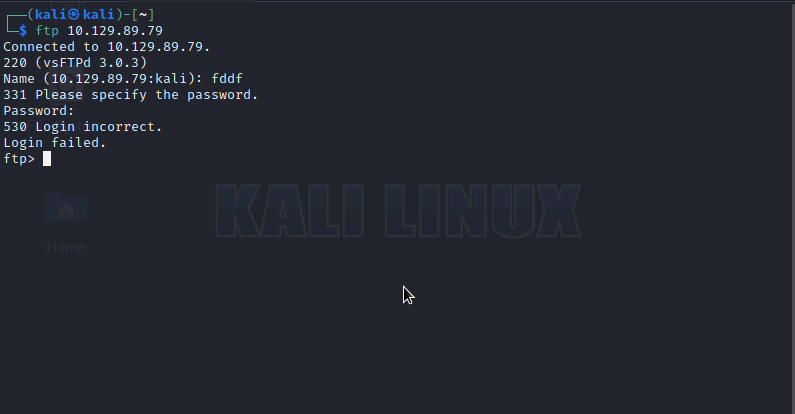
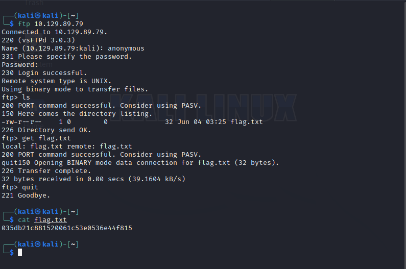

# What does the 3-letter acronym FTP stand for?
File Transfer Protocol

# What communication model does FTP use, architecturally speaking?
client-server model

# What is the name of one popular GUI FTP program?
Filezilla

# Which port is the FTP service active on usually?
21 tcp

# What acronym is used for the secure version of FTP?
sftp

# What is the command we can use to test our connection to the target?
ping

# From your scans, what version is FTP running on the target?
vsftpd 3.0.3 
lets do some nmap scan using the command `nmap <ip address> -A -sV -oN Fawn.nmap`

if we look on our nmap scan we can see that the target is running a ftp version of `vsftpd 3.0.3`

# From your scans, what OS type is running on the target?
unix 
again if we look on our nmap scan we see that the operating system (os) the target is running is `unix`

# Lets get the flag
Lets try login using the command `ftp <ip address>`
 
when we look we see that we require a username and a password but we tried login in and we get login incorrect. 
so here is how we need to login if we check our nmap scan we see anonymous login is enabled on the ftp server so lets try login with the username anonymous and password to be anything we want
 
There we can see we logged in successfully we listed the files within the current working directory we see a file called `flag.txt` we then download the file to our machine and read it using the command `cat flag.txt` and we get the flag `035db21c881520061c53e0536e44f815`  
Lets wrap it around with `HTB{flag}` 
Here is our final flag to submit `HTB{035db21c881520061c53e0536e44f815}` then we submit that then congratulations we have pwned Fawn!