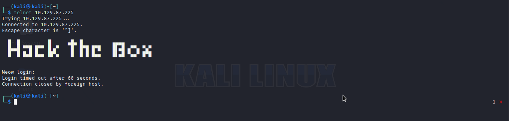

# Task 1
What does the acronym VM stand for?
`Virtual Machine`

# Task 2
What tool do we use to interact with the operating system inorder to start out VPN connection?
`terminal`

# Task 3
What service do we use to form out VPN Connection?
`openvpn`

# Task 4
What is the abbreviated name for a tunnel interface in the output of your VPN boot-up sequence output?
`tun`

# Task 5
What tool do we use to test our connection to the target?
`ping`

# Task 6
What is the name of the script we use to scan the target's ports?
`nmap`

# Task 7
What service do we identify on running on port 23/tcp during our scans? `telnet`
Lets do a nmap scan using the command `nmap <ip address> -A -sV -oN Meow.nmap`
here we can see the ports that are open after executing our command
```
Nmap scan report for 10.129.208.41
Host is up (0.41s latency).
Not shown: 999 closed ports
PORT   STATE SERVICE VERSION
23/tcp open  telnet  Linux telnetd
Service Info: OS: Linux; CPE: cpe:/o:linux:linux_kernel
```
we can see that port 23 is running the telnet service

# Task 8
What username ultimately works with the remote management login prompt for the target? `root`

Lets try connecting to telnet service with the command `telnet <ip address>`<br>
we get a output looking like this


* Lets do some username and password enumeration<br>
Before we can brutefoce we need a wordlist here is a wordlist we can use which contains telnet default credentials: https://raw.githubusercontent.com/danielmiessler/SecLists/master/Passwords/Default-Credentials/telnet-betterdefaultpasslist.txt we can use wget or curl or anything else to download the wordlist but i decided to use wget here is the command to download the wordlist with wget: `wget https://raw.githubusercontent.com/danielmiessler/SecLists/master/Passwords/Default-Credentials/telnet-betterdefaultpasslist.txt`.

Now let the bruteforce begin!<br>
we can use this command to bruteforce with hydra after downloading the wordlist
`hydra <ip address> telnet -C telnet-betterdefaultpasslist.txt`.


There we can see the username is root

* Lets login

There we can see we logged in successfully as root without a password!

# Flag
Lets finally get the flag for the system!
After we have logged into the telnet server successfully we can then list the files using the command `ls`
we will see a file called flag.txt we will then read from the file using the command `cat flag.txt` then we will get the flag


Here is our flag `b40abdfe23665f766f9c61ecba8a4c19` now the only thing we need to do is wrap or surround the flag with `HTB{flag}` voila!
